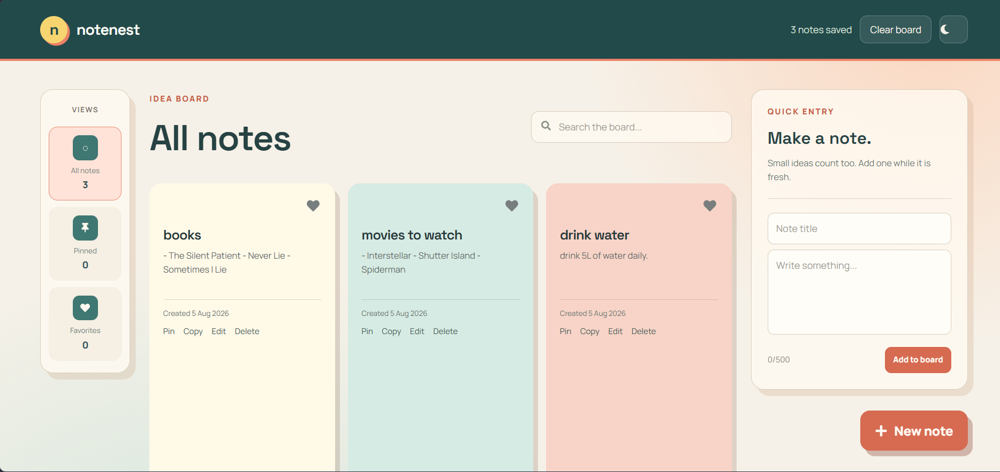
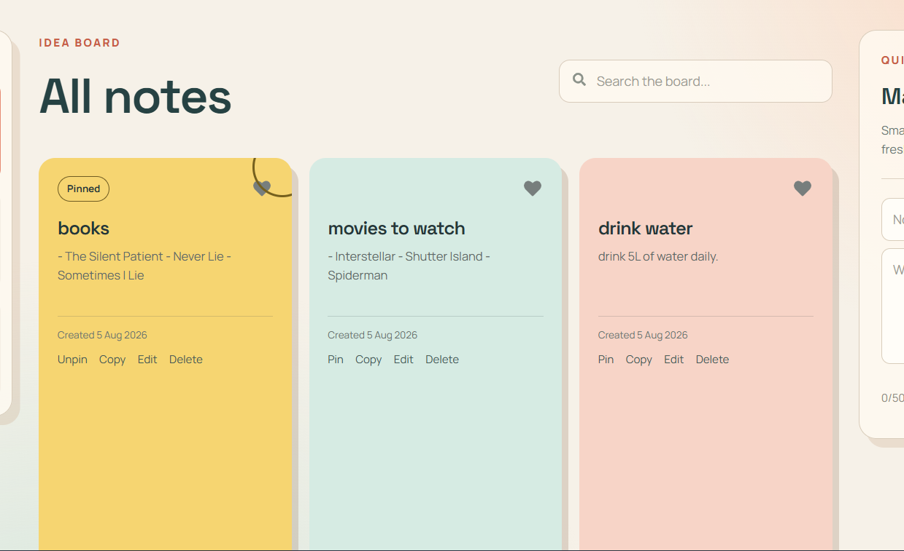

# 📝 NoteNest

A modern and responsive note-taking application built with **React**, **Tailwind CSS**, and **Vite**. NoteNest helps users create, organize, and manage notes with a clean interface and a seamless user experience.

---

## ✨ Features

- 📝 Create and delete notes
- 📌 Pin important notes
- ❤️ Mark notes as favorites
- 🔍 Search notes instantly
- 🗂️ Organize notes with categories
- 💾 Persistent storage using Local Storage
- 🌙 Dark mode
- 📱 Fully responsive design
- ✨ Smooth animations and modern UI

---

## 🛠️ Tech Stack

- React.js
- Tailwind CSS
- Vite
- Local Storage

---


## 📸 Screenshots

### Home Page


### Create Note



### Pinned Notes




---

## 🚀 Getting Started

Clone the repository

```bash
git clone https://github.com/akanksha-codepy/NoteNest-notes-app.git
```

Navigate to the project

```bash
cd NoteNest-notes-app
```

Install dependencies

```bash
npm install
```

Start the development server

```bash
npm run dev
```

---

## 📌 Future Enhancements

- Firebase Authentication
- Cloud Sync
- Rich Text Editor
- Drag & Drop Notes
- Markdown Support
- Archive Notes
- Export Notes as PDF

---

## 👩‍💻 Author

**Akanksha Uchale**

- GitHub: https://github.com/akanksha-codepy
- Portfolio: https://akanksha-uchale-portfolio.netlify.app/

---

⭐ If you like this project, consider giving it a star!